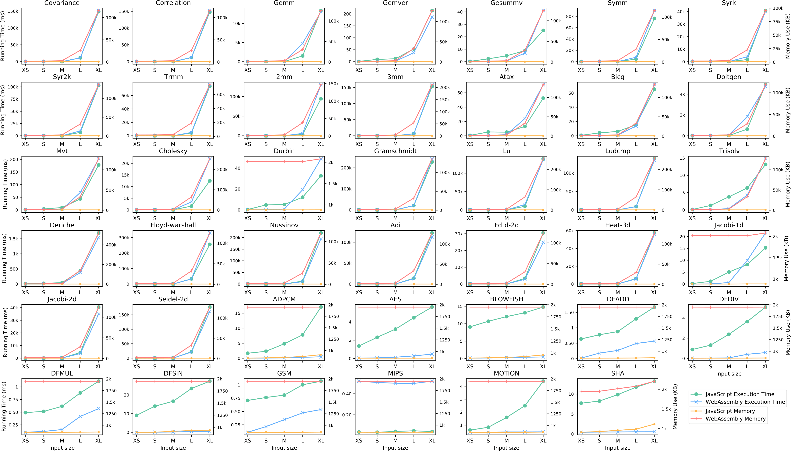
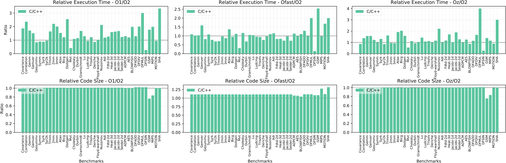
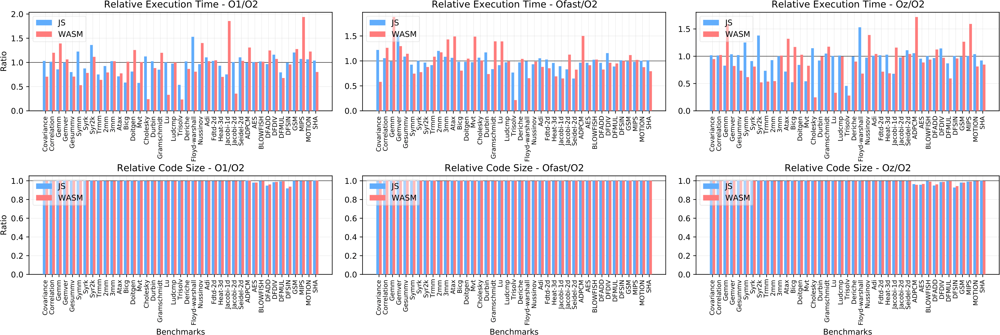
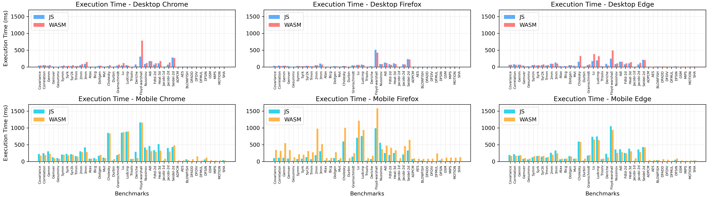
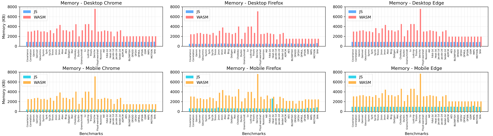

Understanding the Performance of WebAssembly and JavaScript
==

WebAssembly is the newest language to arrive on the web. It features a compact binary format which makes it faster to be loaded and decoded than JavaScript. While WebAssembly is generally expected to be faster than JavaScript, there have been mixed results in proving which code is faster. Unfortunately, the performance of WebAssembly and JavaScript is a complicated equation that is affected by various factors. As a result, developers often face a dilemma in choosing JavaScript or WebAssembly for their web application development.

In this paper, we conduct the first systematic study on the performance comparison of WebAssembly and JavaScript. We use a compiler that can generate both WebAssembly and JavaScript programs from a C source program. We tested 41 widely used C benchmarks and analyzed the contributing factors that impact WebAssembly and JavaScript's performance, providing various insights. We also report the challenges we encountered when compiling the C benchmarks to WebAssembly and discuss our solutions. 

Our findings and insights include: 

(1) while WebAssembly is faster than JavaScript when the program input size is small, for larger inputs, 43.9% of the WebAssembly programs becomes slower than JavaScript; 

(2) WebAssembly compilers are commonly built atop LLVM, where their optimizations are not designed for WebAssembly. Our experiments show that these optimizations become ineffective for WebAssembly and often work oppositely; 

(3) the runtime performance of WebAssembly and JavaScript varies significantly depending on its execution environment, such as browsers and devices (e.g., desktop or mobile); 

(4) WebAssembly programs consistently consume significantly more memory than their JavaScript counterparts. 

Our findings can help developers better understand when to choose WebAssembly over JavaScript or vice versa, and provide insights for WebAssembly tooling developers to identify optimization opportunities.

Dependencies
--

- Cheerp 2.0
- Python 2.7
- Google Chrome, stable version 79   
- Firefox, stable version 71
- Microsoft Edge, stable version 79

Setup and Use Instructions
--

Download the whole repository, then follow instructions below to compile and run the experiment. 
Note that if you want to repeat the experiment in the paper, you can skip step 1. 
 
[Check compilation scripts.](https://github.com/BenchmarkingWasm/BenchmarkingWebAssembly/tree/master/compilation_scripts)

### 1. Experiment Preparation

#### a) Source Code Transformation  
Currently, there is not a universal solution to make every benchmark compatible with Cheerp. 
You can read modifications with comments in each benchmark to check what we have done, 
the purposes of these fixes, possible side effects and how we minimize them.  

We have uploaded modified PolyBenchC and CHStone benchmarks. You can
[check modified benchmarks here.](https://github.com/BenchmarkingWasm/BenchmarkingWebAssembly/tree/master/modified_benchmarks)


#### b) Compilation to WebAssembly/JavaScript  
If you want to test PolyBenchC and CHStone on Cheerp 2.0 only, we have already compiled them under all 
optimization levels and all input sizes. You can 
[check compiled benchmarks here](https://github.com/BenchmarkingWasm/BenchmarkingWebAssembly/tree/master/compiled_benchmarks)
and jump to step 2.
If you want to test other benchmarks or want to use different compilation settings, please continue to read.
##### PolyBenchC

We have provided Python scripts ```compilation_scripts/poly.py``` and ```compilation_scripts/poly2.py``` 
for developers to compile modified PolyBenchC benchmarks. 
To run them, make sure you have installed all dependencies mentioned above, then type ```python poly.py``` and 
```python poly2.py``` in your shell.

If you want to understand, write or modify the script by yourself, this is an example of 
compiling 'correlation' benchmark in PolyBenchC. 

Pay attention to three compile options:
```-cheerp-linear-heap-size=1024``` for enlarging WebAssembly maximum heap size to 1024 MiB,
```-DSMALL_DATASET``` for setting input size to 'S',
```-Oz``` for using optimization level ```-Oz```.

It is the final script used by our scripts:

```
//Compile to JavaScript file
/opt/cheerp/bin/clang -target cheerp datamining/correlation/correlation.c utilities/polybench.c -I utilities -DPOLYBENCH_TIME -cheerp-linear-heap-size=1024 -DSMALL_DATASET -w -Oz -o poly/correlation/js/correlation_-DSMALL_DATASET_Oz.js	
```

```
//Compile to WebAssembly file
/opt/cheerp/bin/clang -target cheerp datamining/correlation/correlation.c utilities/polybench.c -I utilities -DPOLYBENCH_TIME -cheerp-linear-heap-size=1024 -cheerp-mode=wasm -DSMALL_DATASET -w -o poly/correlation/wasm/Oz/correlation_-DSMALL_DATASET_Oz.wasm -Oz -cheerp-wasm-loader=poly/correlation/wasm/Oz/correlation_-DSMALL_DATASET_Oz_load.js
```

It should be noted that there are three specific benchmarks in this suite that need to modify 
'utilities/polybench.c' to the corresponding type before compilation.

```
// [medley] deriche
//void* ret = (float*) malloc (val);
// [medley] floyd-warshall nussinov
//void* ret = (int*) malloc (val);
```

##### CHStone

We have provided the Python script ```compilation_scripts/chs.py```
for developers to compile modified CHStone benchmarks.
To run them, make sure you have installed all dependencies mentioned above, 
then type ```python chs.py``` in your shell.

If you want to understand, write or modify the script by yourself, this is the final script used by our scripts
to compile 'dfsin' benchmark in CHStone.

```
//Compile to JavaScript file
/opt/cheerp/bin/clang -target cheerp dfsin/dfsin.c -cheerp-linear-heap-size=1024 -DXXXL_DATASET -Oz -o chs/dfsin/js/dfsin_-DXXXL_DATASET_Oz.js
```

```
//Compile to WebAssembly file
/opt/cheerp/bin/clang -target cheerp dfsin/dfsin.c -cheerp-linear-heap-size=1024 -cheerp-mode=wasm -DXXXL_DATASET -o chs/dfsin/wasm/Oz/dfsin_-DXXXL_DATASET_Oz.wasm -Oz -cheerp-wasm-loader=chs/dfsin/wasm/Oz/dfsin_-DXXXL_DATASET_Oz_load.js
```

### 2. Experiment Process

#### a) Modify the HTML file to load the JavaScript/WebAssembly file:
JavaScript: replace the value of 'src' with the corresponding JavaScript file path, 
then save the following HTML code as 'test.html';
WebAssembly: replace the value of 'src' with the corresponding 'xx_load.js' file path, 
then save the following HTML code as 'test.html'.

```html
<!DOCTYPE html>
<html lang="en">
<head>
    <script defer src="./XXX.js"></script>
</head>
<body></body>
</html>
```

#### b) Build a local server where 'test.html' locates.

It is fine to use Node.js or any other approach to set up a server. Below is a simple method
if you have python2 installed. 
```
//Works with python 2.7
python -m SimpleHTTPServer 
```

#### c) Clear the browser data, close all pages, and close any unnecessary programs.

#### d) Open the browser in incognito mode, enter ```localhost:8000/test.html```.

#### e) Wait until browser stop loading, open the developer tool of the browser, record the time output from the console.

#### f) Open the 'memory' page of the developer tool, collect the heap snapshot three times, take the last time for stability, (Chrome: switch to stats) to record all data.

#### g) Close the browser. Repeat d-f) for 4 more times. The execution time/memory is the average of 5 time/memory data collected.
 
#### h) Repeat steps d-g) for another benchmark. 

### 3. Statistics
[Check raw test data of the experiment in paper.](https://github.com/BenchmarkingWasm/BenchmarkingWebAssembly/tree/master/test_results) 


Some Findings
--

### RQ1  Program Input Size
[Detailed input size](input_size.md)



Our results show that when benchmarks are tested with extra-small or small input size, WebAssembly is faster than JavaScript in almost all benchmarks (97.6% and 95.1% for extra-small and small respectively). On average, WebAssembly achieves a speedup of 26.99x for extra-small and 8.22x for small. However, when the input size increases to medium, there are 18 benchmarks of which WebAssembly becomes slower than JavaScript. Although the average slowdown of the 18 benchmarks with medium input is not significant (1.71x), the performance difference between WebAssembly and JavaScript for the remaining benchmarks (23 out of 41) also becomes moderate (i.e., on average 6.70x). For example, '3mm' benchmark's performance difference between WebAssembly and JavaScript changes significantly. In particular, the WebAssembly version is 47.71x, 10.54x, and 1.12x faster than its JavaScript version, for extra-small, small, and medium input sizes respectively.

The runtime memory usage of JavaScript stays fairly stable (between 878.73KB and 889.20KB) with diverse inputs. By contrast, the WebAssembly programs consume significantly more memory when the input size increases to Large (increases by 24MB) and Extra-large (increases by 74MB). 

### RQ2  Compiler Optimization



-Ofast generates the fastest code (0.97x execution time relative to -O2). -Oz leads to the smallest target code size (0.99x relative to the -O2). -O2 is a balanced optimization level in terms of execution time (faster than -O1 at 0.74x and -Oz at 0.82x but slower than -Ofast at 1.03x) and resulting code size (smaller than -Ofast at 0.90x but larger than -Oz at 1.01x).



-Ofast generates slower WebAssembly and JavaScript than -O1 and -Oz. -Oz leads to the fastest WebAssembly (0.86x compared to baseline optimization -O2) and the fastest JavaScript (0.94x). Although -O2 is supposed to generate faster target code than -O1 and -Oz, the JavaScript and WebAssembly compiled with -O2 are the slowest. Compared to the baseline where -O2 is used, the resulting code sizes with -O1, -Ofast, and -Oz optimizations are almost identical (with less than 2% variance) for both WebAssembly and JavaScript.  
The memory usage of WebAssembly and JavaScript is mostly the same for all optimization levels. 

### RQ3  Browsers and Platforms




When deployed on desktop, Firefox is slightly slower (1.06x) in executing the compiled JavaScript programs compared to Chrome. However, Firefox executes WebAssembly much faster than Chrome (0.61x).
Compared to the result on desktop, the performance comparison of the three browsers shows different result when deployed on mobile devices.
Specifically, Firefox has better performance on executing JavaScript programs compared to Chrome (0.67x), but it takes much more time (1.48x) to execute the WebAssembly counterparts.
Similarly, Edge performs worse than Chrome for both JavaScript (1.40x) and WebAssembly (1.28x) on desktop. However, Edge outperforms Chrome on mobile for JavaScript (0.81x) and WebAssembly (0.83x). 

All three browsers run WebAssembly and JavaScript slower on mobile than on desktop. Specifically, WebAssembly executed on mobile Chrome is 3.57x slower than desktop Chrome, and JavaScript is 5.48x slower. Compared to Firefox on desktop, mobile Firefox is 8.73x slower and 3.46x slower in executing WebAssembly and JavaScript respectively. Similarly, compared to Edge on desktop, mobile Edge is 2.31x slower and 3.17x slower in executing WebAssembly and JavaScript respectively.



On average, desktop Firefox uses less memory than desktop Chrome for both JavaScript (0.57x) and WebAssembly (0.83x). Desktop Edge uses similar memory as desktop Chrome (0.98x for JavaScript and 1.00x for WebAssembly). 
On the contrary, mobile Firefox and mobile Edge take more memory than mobile Chrome: 1.70x for JavaScript and 1.15x for WebAssembly on Firefox; 2.38x for JavaScript and 1.22x for WebAssembly on Edge.

For all desktop browsers, WebAssembly uses more memory (3.39x on Chrome, 4.93x on Firefox, and 3.44x on Edge) than JavaScript. Browsers for mobile show the similar result: WebAssembly uses 6.20x more memory on Chrome, 4.18x on Firefox, and 3.19x on Edge.